# <span style='font-size: 3em;'>Star Wars</span>

### The team of <a href='http://fivethirtyeight.com/' target='_blank'>FiveThirtyEight</a> bacame interested in answering some questions about Star Wars fans. In particular, they wondered: <span style="font-size: 1.1em; font-weight: bold; color: red;">does the rest of America realize that “The Empire Strikes Back” is clearly the best of the bunch?</span>

<br /><br />


```python
# Load libraries
import pandas as pd
import numpy as np
import matplotlib.pyplot as plt

%matplotlib inline
```


```python
# Load data
star_wars = pd.read_csv("star_wars.csv", encoding="ISO-8859-1")

star_wars.shape
```


    (1187, 38)


```python
star_wars.head()
```


<div>
<style scoped>
    .dataframe tbody tr th:only-of-type {
        vertical-align: middle;
    }

    .dataframe tbody tr th {
        vertical-align: top;
    }

    .dataframe thead th {
        text-align: right;
    }
</style>
<table border="1" class="dataframe">
  <thead>
    <tr style="text-align: right;">
      <th></th>
      <th>RespondentID</th>
      <th>Have you seen any of the 6 films in the Star Wars franchise?</th>
      <th>Do you consider yourself to be a fan of the Star Wars film franchise?</th>
      <th>Which of the following Star Wars films have you seen? Please select all that apply.</th>
      <th>Unnamed: 4</th>
      <th>Unnamed: 5</th>
      <th>Unnamed: 6</th>
      <th>Unnamed: 7</th>
      <th>Unnamed: 8</th>
      <th>Please rank the Star Wars films in order of preference with 1 being your favorite film in the franchise and 6 being your least favorite film.</th>
      <th>...</th>
      <th>Unnamed: 28</th>
      <th>Which character shot first?</th>
      <th>Are you familiar with the Expanded Universe?</th>
      <th>Do you consider yourself to be a fan of the Expanded Universe?ξ</th>
      <th>Do you consider yourself to be a fan of the Star Trek franchise?</th>
      <th>Gender</th>
      <th>Age</th>
      <th>Household Income</th>
      <th>Education</th>
      <th>Location (Census Region)</th>
    </tr>
  </thead>
  <tbody>
    <tr>
      <th>0</th>
      <td>NaN</td>
      <td>Response</td>
      <td>Response</td>
      <td>Star Wars: Episode I  The Phantom Menace</td>
      <td>Star Wars: Episode II  Attack of the Clones</td>
      <td>Star Wars: Episode III  Revenge of the Sith</td>
      <td>Star Wars: Episode IV  A New Hope</td>
      <td>Star Wars: Episode V The Empire Strikes Back</td>
      <td>Star Wars: Episode VI Return of the Jedi</td>
      <td>Star Wars: Episode I  The Phantom Menace</td>
      <td>...</td>
      <td>Yoda</td>
      <td>Response</td>
      <td>Response</td>
      <td>Response</td>
      <td>Response</td>
      <td>Response</td>
      <td>Response</td>
      <td>Response</td>
      <td>Response</td>
      <td>Response</td>
    </tr>
    <tr>
      <th>1</th>
      <td>3.292880e+09</td>
      <td>Yes</td>
      <td>Yes</td>
      <td>Star Wars: Episode I  The Phantom Menace</td>
      <td>Star Wars: Episode II  Attack of the Clones</td>
      <td>Star Wars: Episode III  Revenge of the Sith</td>
      <td>Star Wars: Episode IV  A New Hope</td>
      <td>Star Wars: Episode V The Empire Strikes Back</td>
      <td>Star Wars: Episode VI Return of the Jedi</td>
      <td>3</td>
      <td>...</td>
      <td>Very favorably</td>
      <td>I don't understand this question</td>
      <td>Yes</td>
      <td>No</td>
      <td>No</td>
      <td>Male</td>
      <td>18-29</td>
      <td>NaN</td>
      <td>High school degree</td>
      <td>South Atlantic</td>
    </tr>
    <tr>
      <th>2</th>
      <td>3.292880e+09</td>
      <td>No</td>
      <td>NaN</td>
      <td>NaN</td>
      <td>NaN</td>
      <td>NaN</td>
      <td>NaN</td>
      <td>NaN</td>
      <td>NaN</td>
      <td>NaN</td>
      <td>...</td>
      <td>NaN</td>
      <td>NaN</td>
      <td>NaN</td>
      <td>NaN</td>
      <td>Yes</td>
      <td>Male</td>
      <td>18-29</td>
      <td>$0 - $24,999</td>
      <td>Bachelor degree</td>
      <td>West South Central</td>
    </tr>
    <tr>
      <th>3</th>
      <td>3.292765e+09</td>
      <td>Yes</td>
      <td>No</td>
      <td>Star Wars: Episode I  The Phantom Menace</td>
      <td>Star Wars: Episode II  Attack of the Clones</td>
      <td>Star Wars: Episode III  Revenge of the Sith</td>
      <td>NaN</td>
      <td>NaN</td>
      <td>NaN</td>
      <td>1</td>
      <td>...</td>
      <td>Unfamiliar (N/A)</td>
      <td>I don't understand this question</td>
      <td>No</td>
      <td>NaN</td>
      <td>No</td>
      <td>Male</td>
      <td>18-29</td>
      <td>$0 - $24,999</td>
      <td>High school degree</td>
      <td>West North Central</td>
    </tr>
    <tr>
      <th>4</th>
      <td>3.292763e+09</td>
      <td>Yes</td>
      <td>Yes</td>
      <td>Star Wars: Episode I  The Phantom Menace</td>
      <td>Star Wars: Episode II  Attack of the Clones</td>
      <td>Star Wars: Episode III  Revenge of the Sith</td>
      <td>Star Wars: Episode IV  A New Hope</td>
      <td>Star Wars: Episode V The Empire Strikes Back</td>
      <td>Star Wars: Episode VI Return of the Jedi</td>
      <td>5</td>
      <td>...</td>
      <td>Very favorably</td>
      <td>I don't understand this question</td>
      <td>No</td>
      <td>NaN</td>
      <td>Yes</td>
      <td>Male</td>
      <td>18-29</td>
      <td>$100,000 - $149,999</td>
      <td>Some college or Associate degree</td>
      <td>West North Central</td>
    </tr>
  </tbody>
</table>
<p>5 rows × 38 columns</p>
</div>


## Cleaning data


```python
# Checking columns
star_wars.columns
```


    Index(['RespondentID',
           'Have you seen any of the 6 films in the Star Wars franchise?',
           'Do you consider yourself to be a fan of the Star Wars film franchise?',
           'Which of the following Star Wars films have you seen? Please select all that apply.',
           'Unnamed: 4', 'Unnamed: 5', 'Unnamed: 6', 'Unnamed: 7', 'Unnamed: 8',
           'Please rank the Star Wars films in order of preference with 1 being your favorite film in the franchise and 6 being your least favorite film.',
           'Unnamed: 10', 'Unnamed: 11', 'Unnamed: 12', 'Unnamed: 13',
           'Unnamed: 14',
           'Please state whether you view the following characters favorably, unfavorably, or are unfamiliar with him/her.',
           'Unnamed: 16', 'Unnamed: 17', 'Unnamed: 18', 'Unnamed: 19',
           'Unnamed: 20', 'Unnamed: 21', 'Unnamed: 22', 'Unnamed: 23',
           'Unnamed: 24', 'Unnamed: 25', 'Unnamed: 26', 'Unnamed: 27',
           'Unnamed: 28', 'Which character shot first?',
           'Are you familiar with the Expanded Universe?',
           'Do you consider yourself to be a fan of the Expanded Universe?ξ',
           'Do you consider yourself to be a fan of the Star Trek franchise?',
           'Gender', 'Age', 'Household Income', 'Education',
           'Location (Census Region)'],
          dtype='object')


```python
# Remove all rows with ResponseId equal NaN
star_wars = star_wars[star_wars['RespondentID'].notnull()]

star_wars.shape
```


    (1186, 38)


```python
# Convert the columns to boolean
yes_no = {'Yes': True, 'No': False}

star_wars['Have you seen any of the 6 films in the Star Wars franchise?'] = star_wars['Have you seen any of the 6 films in the Star Wars franchise?'].map(yes_no)

star_wars['Have you seen any of the 6 films in the Star Wars franchise?'].value_counts()
```


    True     936
    False    250
    Name: Have you seen any of the 6 films in the Star Wars franchise?, dtype: int64


```python
star_wars['Do you consider yourself to be a fan of the Star Wars film franchise?'] = star_wars['Do you consider yourself to be a fan of the Star Wars film franchise?'].map(yes_no)

star_wars['Do you consider yourself to be a fan of the Star Wars film franchise?'].value_counts()

```


    True     552
    False    284
    Name: Do you consider yourself to be a fan of the Star Wars film franchise?, dtype: int64


```python
star_wars[star_wars.columns[3:9]] = star_wars[star_wars.columns[3:9]].fillna(False)
star_wars[star_wars.columns[3:9]] = star_wars[star_wars.columns[3:9]].astype('bool')

star_wars.head(10)
```


<div>
<style scoped>
    .dataframe tbody tr th:only-of-type {
        vertical-align: middle;
    }

    .dataframe tbody tr th {
        vertical-align: top;
    }

    .dataframe thead th {
        text-align: right;
    }
</style>
<table border="1" class="dataframe">
  <thead>
    <tr style="text-align: right;">
      <th></th>
      <th>RespondentID</th>
      <th>Have you seen any of the 6 films in the Star Wars franchise?</th>
      <th>Do you consider yourself to be a fan of the Star Wars film franchise?</th>
      <th>Which of the following Star Wars films have you seen? Please select all that apply.</th>
      <th>Unnamed: 4</th>
      <th>Unnamed: 5</th>
      <th>Unnamed: 6</th>
      <th>Unnamed: 7</th>
      <th>Unnamed: 8</th>
      <th>Please rank the Star Wars films in order of preference with 1 being your favorite film in the franchise and 6 being your least favorite film.</th>
      <th>...</th>
      <th>Unnamed: 28</th>
      <th>Which character shot first?</th>
      <th>Are you familiar with the Expanded Universe?</th>
      <th>Do you consider yourself to be a fan of the Expanded Universe?ξ</th>
      <th>Do you consider yourself to be a fan of the Star Trek franchise?</th>
      <th>Gender</th>
      <th>Age</th>
      <th>Household Income</th>
      <th>Education</th>
      <th>Location (Census Region)</th>
    </tr>
  </thead>
  <tbody>
    <tr>
      <th>1</th>
      <td>3.292880e+09</td>
      <td>True</td>
      <td>True</td>
      <td>True</td>
      <td>True</td>
      <td>True</td>
      <td>True</td>
      <td>True</td>
      <td>True</td>
      <td>3</td>
      <td>...</td>
      <td>Very favorably</td>
      <td>I don't understand this question</td>
      <td>Yes</td>
      <td>No</td>
      <td>No</td>
      <td>Male</td>
      <td>18-29</td>
      <td>NaN</td>
      <td>High school degree</td>
      <td>South Atlantic</td>
    </tr>
    <tr>
      <th>2</th>
      <td>3.292880e+09</td>
      <td>False</td>
      <td>NaN</td>
      <td>False</td>
      <td>False</td>
      <td>False</td>
      <td>False</td>
      <td>False</td>
      <td>False</td>
      <td>NaN</td>
      <td>...</td>
      <td>NaN</td>
      <td>NaN</td>
      <td>NaN</td>
      <td>NaN</td>
      <td>Yes</td>
      <td>Male</td>
      <td>18-29</td>
      <td>$0 - $24,999</td>
      <td>Bachelor degree</td>
      <td>West South Central</td>
    </tr>
    <tr>
      <th>3</th>
      <td>3.292765e+09</td>
      <td>True</td>
      <td>False</td>
      <td>True</td>
      <td>True</td>
      <td>True</td>
      <td>False</td>
      <td>False</td>
      <td>False</td>
      <td>1</td>
      <td>...</td>
      <td>Unfamiliar (N/A)</td>
      <td>I don't understand this question</td>
      <td>No</td>
      <td>NaN</td>
      <td>No</td>
      <td>Male</td>
      <td>18-29</td>
      <td>$0 - $24,999</td>
      <td>High school degree</td>
      <td>West North Central</td>
    </tr>
    <tr>
      <th>4</th>
      <td>3.292763e+09</td>
      <td>True</td>
      <td>True</td>
      <td>True</td>
      <td>True</td>
      <td>True</td>
      <td>True</td>
      <td>True</td>
      <td>True</td>
      <td>5</td>
      <td>...</td>
      <td>Very favorably</td>
      <td>I don't understand this question</td>
      <td>No</td>
      <td>NaN</td>
      <td>Yes</td>
      <td>Male</td>
      <td>18-29</td>
      <td>$100,000 - $149,999</td>
      <td>Some college or Associate degree</td>
      <td>West North Central</td>
    </tr>
    <tr>
      <th>5</th>
      <td>3.292731e+09</td>
      <td>True</td>
      <td>True</td>
      <td>True</td>
      <td>True</td>
      <td>True</td>
      <td>True</td>
      <td>True</td>
      <td>True</td>
      <td>5</td>
      <td>...</td>
      <td>Somewhat favorably</td>
      <td>Greedo</td>
      <td>Yes</td>
      <td>No</td>
      <td>No</td>
      <td>Male</td>
      <td>18-29</td>
      <td>$100,000 - $149,999</td>
      <td>Some college or Associate degree</td>
      <td>West North Central</td>
    </tr>
    <tr>
      <th>6</th>
      <td>3.292719e+09</td>
      <td>True</td>
      <td>True</td>
      <td>True</td>
      <td>True</td>
      <td>True</td>
      <td>True</td>
      <td>True</td>
      <td>True</td>
      <td>1</td>
      <td>...</td>
      <td>Very favorably</td>
      <td>Han</td>
      <td>Yes</td>
      <td>No</td>
      <td>Yes</td>
      <td>Male</td>
      <td>18-29</td>
      <td>$25,000 - $49,999</td>
      <td>Bachelor degree</td>
      <td>Middle Atlantic</td>
    </tr>
    <tr>
      <th>7</th>
      <td>3.292685e+09</td>
      <td>True</td>
      <td>True</td>
      <td>True</td>
      <td>True</td>
      <td>True</td>
      <td>True</td>
      <td>True</td>
      <td>True</td>
      <td>6</td>
      <td>...</td>
      <td>Very favorably</td>
      <td>Han</td>
      <td>Yes</td>
      <td>No</td>
      <td>No</td>
      <td>Male</td>
      <td>18-29</td>
      <td>NaN</td>
      <td>High school degree</td>
      <td>East North Central</td>
    </tr>
    <tr>
      <th>8</th>
      <td>3.292664e+09</td>
      <td>True</td>
      <td>True</td>
      <td>True</td>
      <td>True</td>
      <td>True</td>
      <td>True</td>
      <td>True</td>
      <td>True</td>
      <td>4</td>
      <td>...</td>
      <td>Very favorably</td>
      <td>Han</td>
      <td>No</td>
      <td>NaN</td>
      <td>Yes</td>
      <td>Male</td>
      <td>18-29</td>
      <td>NaN</td>
      <td>High school degree</td>
      <td>South Atlantic</td>
    </tr>
    <tr>
      <th>9</th>
      <td>3.292654e+09</td>
      <td>True</td>
      <td>True</td>
      <td>True</td>
      <td>True</td>
      <td>True</td>
      <td>True</td>
      <td>True</td>
      <td>True</td>
      <td>5</td>
      <td>...</td>
      <td>Somewhat favorably</td>
      <td>Han</td>
      <td>No</td>
      <td>NaN</td>
      <td>No</td>
      <td>Male</td>
      <td>18-29</td>
      <td>$0 - $24,999</td>
      <td>Some college or Associate degree</td>
      <td>South Atlantic</td>
    </tr>
    <tr>
      <th>10</th>
      <td>3.292640e+09</td>
      <td>True</td>
      <td>False</td>
      <td>False</td>
      <td>True</td>
      <td>False</td>
      <td>False</td>
      <td>False</td>
      <td>False</td>
      <td>1</td>
      <td>...</td>
      <td>Very favorably</td>
      <td>I don't understand this question</td>
      <td>No</td>
      <td>NaN</td>
      <td>No</td>
      <td>Male</td>
      <td>18-29</td>
      <td>$25,000 - $49,999</td>
      <td>Some college or Associate degree</td>
      <td>Pacific</td>
    </tr>
  </tbody>
</table>
<p>10 rows × 38 columns</p>
</div>


```python
# Rename columns

cols = {}
pos = 4
for col in star_wars.columns[3:6]:
    cols[col] = 'seen_movie_{}'.format(pos)
    pos += 1
    
pos = 1
for col in star_wars.columns[6:9]:
    cols[col] = 'seen_movie_{}'.format(pos)
    pos += 1
    
star_wars.rename(columns = cols, inplace = True)

star_wars.head()
```


<div>
<style scoped>
    .dataframe tbody tr th:only-of-type {
        vertical-align: middle;
    }

    .dataframe tbody tr th {
        vertical-align: top;
    }

    .dataframe thead th {
        text-align: right;
    }
</style>
<table border="1" class="dataframe">
  <thead>
    <tr style="text-align: right;">
      <th></th>
      <th>RespondentID</th>
      <th>Have you seen any of the 6 films in the Star Wars franchise?</th>
      <th>Do you consider yourself to be a fan of the Star Wars film franchise?</th>
      <th>seen_movie_4</th>
      <th>seen_movie_5</th>
      <th>seen_movie_6</th>
      <th>seen_movie_1</th>
      <th>seen_movie_2</th>
      <th>seen_movie_3</th>
      <th>Please rank the Star Wars films in order of preference with 1 being your favorite film in the franchise and 6 being your least favorite film.</th>
      <th>...</th>
      <th>Unnamed: 28</th>
      <th>Which character shot first?</th>
      <th>Are you familiar with the Expanded Universe?</th>
      <th>Do you consider yourself to be a fan of the Expanded Universe?ξ</th>
      <th>Do you consider yourself to be a fan of the Star Trek franchise?</th>
      <th>Gender</th>
      <th>Age</th>
      <th>Household Income</th>
      <th>Education</th>
      <th>Location (Census Region)</th>
    </tr>
  </thead>
  <tbody>
    <tr>
      <th>1</th>
      <td>3.292880e+09</td>
      <td>True</td>
      <td>True</td>
      <td>True</td>
      <td>True</td>
      <td>True</td>
      <td>True</td>
      <td>True</td>
      <td>True</td>
      <td>3</td>
      <td>...</td>
      <td>Very favorably</td>
      <td>I don't understand this question</td>
      <td>Yes</td>
      <td>No</td>
      <td>No</td>
      <td>Male</td>
      <td>18-29</td>
      <td>NaN</td>
      <td>High school degree</td>
      <td>South Atlantic</td>
    </tr>
    <tr>
      <th>2</th>
      <td>3.292880e+09</td>
      <td>False</td>
      <td>NaN</td>
      <td>False</td>
      <td>False</td>
      <td>False</td>
      <td>False</td>
      <td>False</td>
      <td>False</td>
      <td>NaN</td>
      <td>...</td>
      <td>NaN</td>
      <td>NaN</td>
      <td>NaN</td>
      <td>NaN</td>
      <td>Yes</td>
      <td>Male</td>
      <td>18-29</td>
      <td>$0 - $24,999</td>
      <td>Bachelor degree</td>
      <td>West South Central</td>
    </tr>
    <tr>
      <th>3</th>
      <td>3.292765e+09</td>
      <td>True</td>
      <td>False</td>
      <td>True</td>
      <td>True</td>
      <td>True</td>
      <td>False</td>
      <td>False</td>
      <td>False</td>
      <td>1</td>
      <td>...</td>
      <td>Unfamiliar (N/A)</td>
      <td>I don't understand this question</td>
      <td>No</td>
      <td>NaN</td>
      <td>No</td>
      <td>Male</td>
      <td>18-29</td>
      <td>$0 - $24,999</td>
      <td>High school degree</td>
      <td>West North Central</td>
    </tr>
    <tr>
      <th>4</th>
      <td>3.292763e+09</td>
      <td>True</td>
      <td>True</td>
      <td>True</td>
      <td>True</td>
      <td>True</td>
      <td>True</td>
      <td>True</td>
      <td>True</td>
      <td>5</td>
      <td>...</td>
      <td>Very favorably</td>
      <td>I don't understand this question</td>
      <td>No</td>
      <td>NaN</td>
      <td>Yes</td>
      <td>Male</td>
      <td>18-29</td>
      <td>$100,000 - $149,999</td>
      <td>Some college or Associate degree</td>
      <td>West North Central</td>
    </tr>
    <tr>
      <th>5</th>
      <td>3.292731e+09</td>
      <td>True</td>
      <td>True</td>
      <td>True</td>
      <td>True</td>
      <td>True</td>
      <td>True</td>
      <td>True</td>
      <td>True</td>
      <td>5</td>
      <td>...</td>
      <td>Somewhat favorably</td>
      <td>Greedo</td>
      <td>Yes</td>
      <td>No</td>
      <td>No</td>
      <td>Male</td>
      <td>18-29</td>
      <td>$100,000 - $149,999</td>
      <td>Some college or Associate degree</td>
      <td>West North Central</td>
    </tr>
  </tbody>
</table>
<p>5 rows × 38 columns</p>
</div>


```python
# Convert rank columns to float data type and rename them

star_wars[star_wars.columns[9:15]] = star_wars[star_wars.columns[9:15]].astype(float)

cols = {}
pos = 4
for col in star_wars.columns[9:12]:
    cols[col] = 'ranking_movie_{}'.format(pos)
    pos += 1
    
pos = 1
for col in star_wars.columns[12:15]:
    cols[col] = 'ranking_movie_{}'.format(pos)
    pos += 1
    
star_wars.rename(columns = cols, inplace = True)

star_wars.iloc[:,9:15].head()
```


<div>
<style scoped>
    .dataframe tbody tr th:only-of-type {
        vertical-align: middle;
    }

    .dataframe tbody tr th {
        vertical-align: top;
    }

    .dataframe thead th {
        text-align: right;
    }
</style>
<table border="1" class="dataframe">
  <thead>
    <tr style="text-align: right;">
      <th></th>
      <th>ranking_movie_4</th>
      <th>ranking_movie_5</th>
      <th>ranking_movie_6</th>
      <th>ranking_movie_1</th>
      <th>ranking_movie_2</th>
      <th>ranking_movie_3</th>
    </tr>
  </thead>
  <tbody>
    <tr>
      <th>1</th>
      <td>3.0</td>
      <td>2.0</td>
      <td>1.0</td>
      <td>4.0</td>
      <td>5.0</td>
      <td>6.0</td>
    </tr>
    <tr>
      <th>2</th>
      <td>NaN</td>
      <td>NaN</td>
      <td>NaN</td>
      <td>NaN</td>
      <td>NaN</td>
      <td>NaN</td>
    </tr>
    <tr>
      <th>3</th>
      <td>1.0</td>
      <td>2.0</td>
      <td>3.0</td>
      <td>4.0</td>
      <td>5.0</td>
      <td>6.0</td>
    </tr>
    <tr>
      <th>4</th>
      <td>5.0</td>
      <td>6.0</td>
      <td>1.0</td>
      <td>2.0</td>
      <td>4.0</td>
      <td>3.0</td>
    </tr>
    <tr>
      <th>5</th>
      <td>5.0</td>
      <td>4.0</td>
      <td>6.0</td>
      <td>2.0</td>
      <td>1.0</td>
      <td>3.0</td>
    </tr>
  </tbody>
</table>
</div>


## <span style='color: red;'>Find the highest-ranked move</span>


```python
star_wars.iloc[:, 9:15].mean().plot.bar();
```


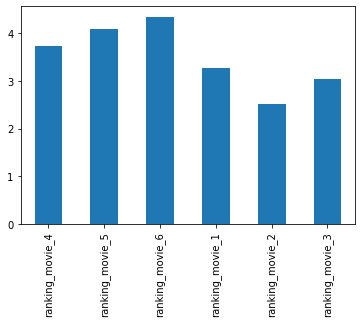


### <span style='color: blue;'>Ranking</span>

#### The three first movies are the highest-ranked. Following the order of the 2sd, 1st, and 3rd movie. Those are the original movies.


```python
star_wars.iloc[: ,3:9].sum().plot.bar();
```


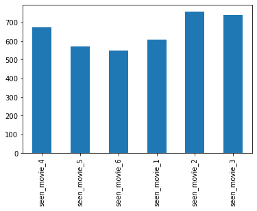


### <span style='color: blue;'>Number of views</span>

#### The first two movies of the trilogy have had more seen than the others that can relate to why they have a better ranking. At least is possible to say that the second movies were more popular.


## <span style='color: red;'>What are the number of views and the rank of different groups? Analyzing the number of views for fans vs non-fans and gender.</span>

## <span style='color: blue;'>Gender</span>


```python
male = star_wars[star_wars['Gender'] == 'Male']
female = star_wars[star_wars['Gender'] == 'Female']
```


```python
male.iloc[:, 9:15].mean().plot.bar()
plt.show();

female.iloc[:, 9:15].mean().plot.bar();
```


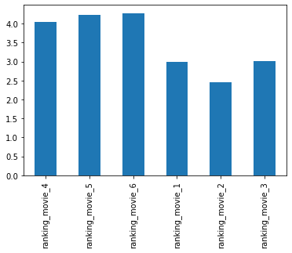


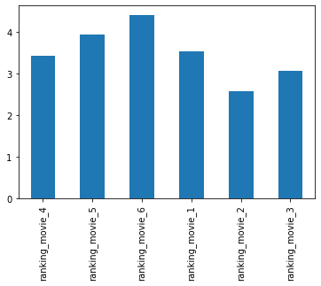


### <span style='color: blue;'>Ranking</span>

#### The ranking per gender follows the same as the ranking in general and the first movies still highest-ranked.


```python
male.iloc[:, 3:9].sum().plot.bar()
plt.show();

female.iloc[:, 3:9].sum().plot.bar();
```


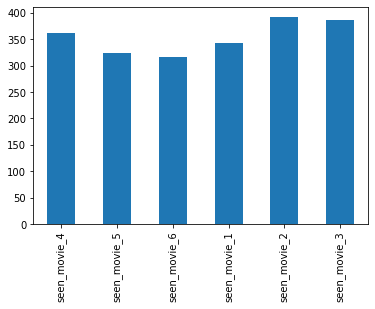


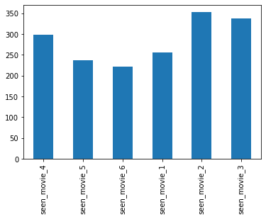


### <span style='color: blue;'>Number of views</span>

#### Same for the number of views. The first movies have more views but we have more males watching the trilogy than females.


## <span style='color: blue;'>Fans</span>


```python
fans = star_wars[star_wars['Do you consider yourself to be a fan of the Star Wars film franchise?'] == True]
non_fans = star_wars[star_wars['Do you consider yourself to be a fan of the Star Wars film franchise?'] == False]
```


```python
fans.iloc[:, 9:15].mean().plot.bar()
plt.show();

non_fans.iloc[:, 9:15].mean().plot.bar();
```


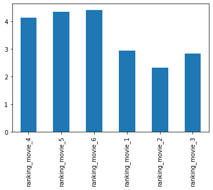


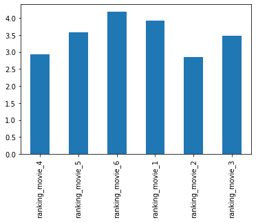


### <span style='color: blue;'>Ranking</span>

#### The fans have a big preference for the first three movies while the non-fans ranked them at the same level. Even to non-fans, the 4th move is the second highest-ranked.


```python
fans.iloc[:, 3:9].sum().plot.bar()
plt.show();

non_fans.iloc[:, 3:9].sum().plot.bar();
```


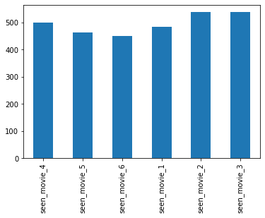


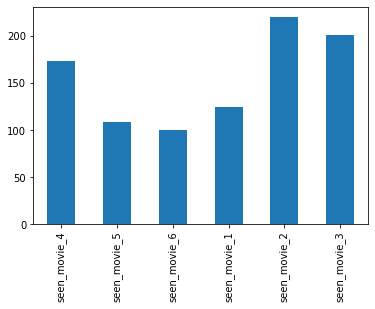


### <span style='color: blue;'>Number of views</span>

#### The fans have almost a stable number of views to all movies while the non-fans dropped the views violently after the fourth movie and the first was not popular too. <br />The difference in the number of views between fans and non-fans is almost double for the fans.

<br /><br />
## <span style='color: red;'>Are the household income and education level correlated with be a fan or not and the ranking of the movies?</span>


## <span style='color: blue;'>Household income</span>


```python
income = star_wars.groupby('Household Income').agg(np.mean)

income.iloc[:, 9:15].round(2)
```


<div>
<style scoped>
    .dataframe tbody tr th:only-of-type {
        vertical-align: middle;
    }

    .dataframe tbody tr th {
        vertical-align: top;
    }

    .dataframe thead th {
        text-align: right;
    }
</style>
<table border="1" class="dataframe">
  <thead>
    <tr style="text-align: right;">
      <th></th>
      <th>ranking_movie_5</th>
      <th>ranking_movie_6</th>
      <th>ranking_movie_1</th>
      <th>ranking_movie_2</th>
      <th>ranking_movie_3</th>
    </tr>
    <tr>
      <th>Household Income</th>
      <th></th>
      <th></th>
      <th></th>
      <th></th>
      <th></th>
    </tr>
  </thead>
  <tbody>
    <tr>
      <th>$0 - $24,999</th>
      <td>3.96</td>
      <td>4.10</td>
      <td>3.17</td>
      <td>2.74</td>
      <td>3.20</td>
    </tr>
    <tr>
      <th>$100,000 - $149,999</th>
      <td>4.17</td>
      <td>4.40</td>
      <td>3.40</td>
      <td>2.40</td>
      <td>2.85</td>
    </tr>
    <tr>
      <th>$150,000+</th>
      <td>4.38</td>
      <td>4.57</td>
      <td>2.96</td>
      <td>2.32</td>
      <td>3.03</td>
    </tr>
    <tr>
      <th>$25,000 - $49,999</th>
      <td>3.87</td>
      <td>4.25</td>
      <td>3.65</td>
      <td>2.48</td>
      <td>3.28</td>
    </tr>
    <tr>
      <th>$50,000 - $99,999</th>
      <td>4.18</td>
      <td>4.34</td>
      <td>3.09</td>
      <td>2.45</td>
      <td>3.11</td>
    </tr>
  </tbody>
</table>
</div>


```python
income.reset_index(inplace = True)

income.plot(x = 'Household Income', y = income.columns[11:17], kind='bar', figsize = (14,8));
plt.legend(loc='center left', bbox_to_anchor=(1.0, 0.5));
```


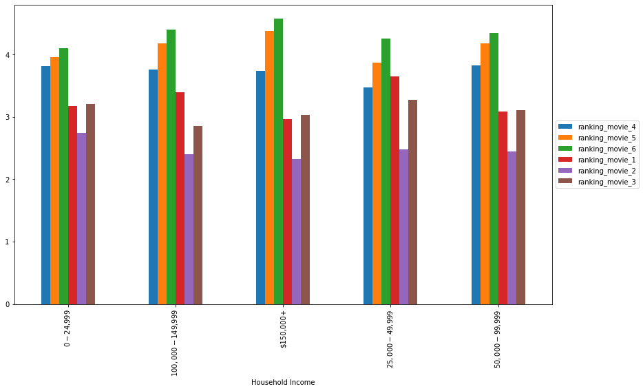


### <span style='color: blue;'>Ranking</span>

#### For all household income, the second movie is the highest-ranked and the sixth is the least-ranked.


```python
# Porcentage of fans per household income

ax = (
        (fans['Household Income'].value_counts() / star_wars['Household Income'].value_counts() * 100)
        .plot.bar(figsize = (14,10))
)

for p in ax.patches:
    ax.annotate('{}%'.format(round(p.get_height(), 2)), (p.get_x() + 0.1, p.get_height() + 1.1), fontsize = 16, color = 'red')
    ax.text

plt.tight_layout()
plt.show()
```


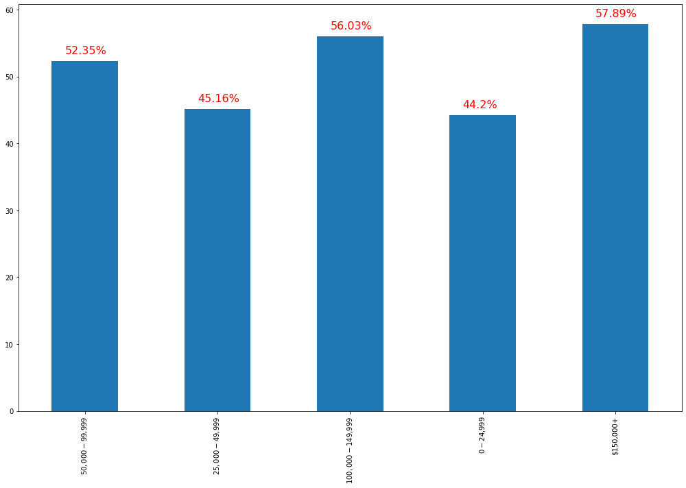


### <span style='color: blue;'>Fans per household income</span>

#### The percentage of fans per household income is bigger for the highest income.


## <span style='color: blue;'>Education</span>


```python
education = star_wars.groupby('Education').agg(np.mean)

education.iloc[:, 9:15].round(2)
```


<div>
<style scoped>
    .dataframe tbody tr th:only-of-type {
        vertical-align: middle;
    }

    .dataframe tbody tr th {
        vertical-align: top;
    }

    .dataframe thead th {
        text-align: right;
    }
</style>
<table border="1" class="dataframe">
  <thead>
    <tr style="text-align: right;">
      <th></th>
      <th>ranking_movie_5</th>
      <th>ranking_movie_6</th>
      <th>ranking_movie_1</th>
      <th>ranking_movie_2</th>
      <th>ranking_movie_3</th>
    </tr>
    <tr>
      <th>Education</th>
      <th></th>
      <th></th>
      <th></th>
      <th></th>
      <th></th>
    </tr>
  </thead>
  <tbody>
    <tr>
      <th>Bachelor degree</th>
      <td>4.29</td>
      <td>4.52</td>
      <td>3.11</td>
      <td>2.31</td>
      <td>2.93</td>
    </tr>
    <tr>
      <th>Graduate degree</th>
      <td>4.23</td>
      <td>4.50</td>
      <td>3.20</td>
      <td>2.32</td>
      <td>2.92</td>
    </tr>
    <tr>
      <th>High school degree</th>
      <td>3.75</td>
      <td>4.13</td>
      <td>3.21</td>
      <td>2.87</td>
      <td>3.24</td>
    </tr>
    <tr>
      <th>Less than high school degree</th>
      <td>5.33</td>
      <td>3.67</td>
      <td>2.67</td>
      <td>1.00</td>
      <td>3.33</td>
    </tr>
    <tr>
      <th>Some college or Associate degree</th>
      <td>3.89</td>
      <td>4.10</td>
      <td>3.50</td>
      <td>2.78</td>
      <td>3.17</td>
    </tr>
  </tbody>
</table>
</div>


```python
education.reset_index(inplace = True)

education.plot(x = 'Education', y = income.columns[8:14], kind='bar', figsize = (14,8));
plt.legend(loc='center left', bbox_to_anchor=(1.0, 0.5));
```


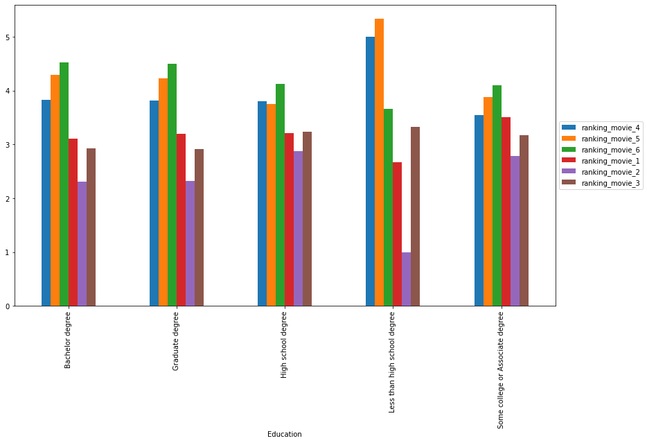


### <span style='color: blue;'>Ranking</span>

#### For all education level, the second movie is the highest-ranked.


```python
# Porcentage of fans per education level

ax = (
        (fans['Education'].value_counts() / star_wars['Education'].value_counts() * 100)
        .plot.bar(figsize = (14,10))
)

for p in ax.patches:
    ax.annotate('{}%'.format(round(p.get_height(), 2)), (p.get_x() + 0.1, p.get_height() + 1.1), fontsize = 16, color = 'red')
    ax.text

plt.tight_layout()
plt.show()
```


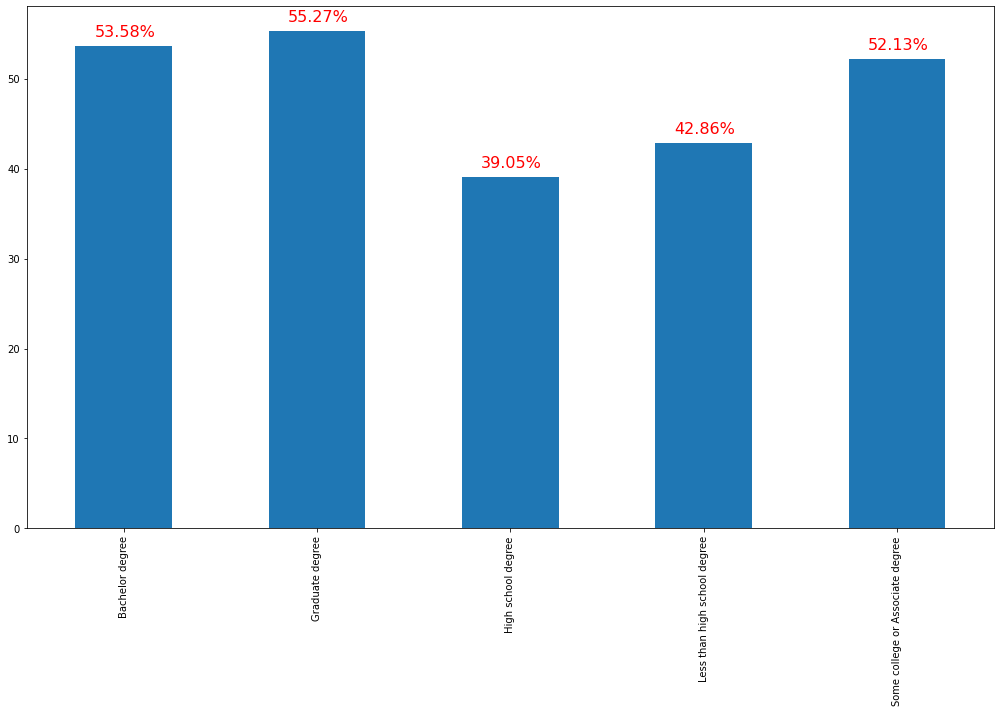


### <span style='color: blue;'>Fans per education level</span>

#### The percentage of fans per education level is bigger for the graduate degree.

<br /><br />
## <span style='color: red;'>Is the number of views related to age?</span>


```python
age = star_wars.groupby('Age').agg(np.mean)

age.reset_index(inplace = True)
age.plot(x = 'Age', y = income.columns[2:8], kind='bar', figsize = (14,8));
plt.legend(loc='center left', bbox_to_anchor=(1.0, 0.5));
```


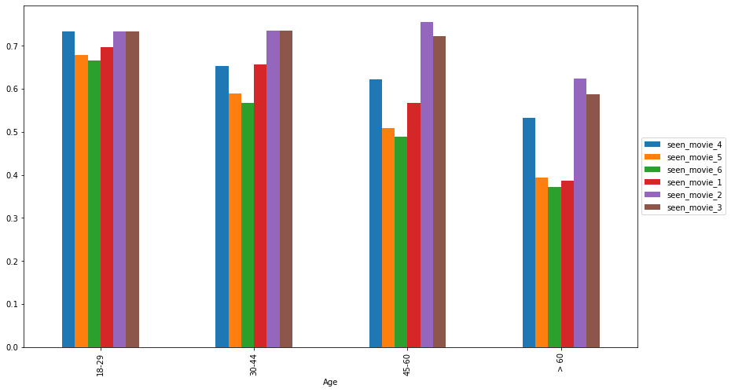


### <span style='color: blue;'>Views per age</span>

#### It is possible to note that for younger people we have more stable views for all movies.


# <span style='color: blue;'>Answer:</span>

## Yes, “The Empire Strikes Back” is clearly the best of the bunch. The movie number two is highest-ranked and has more views.
